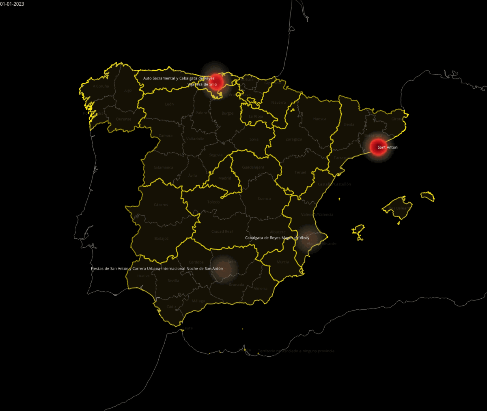

# Party to live or live to party?
## Research of the Festival Industry in Spain. 
Research question: [is it possible to fest in Spain all year round seamlessly?](https://blog.iaac.net/party-to-live-or-live-to-party/) 
tools: Python 3.8, Jupyter Notebook, Pandas, GoogleDeepTranslator, BeautifulSoup, Grasshopper (Rhinoceros 3d 7), QGIS 3.28.2, Capcut. 
# What I learned: 
- Data mining, data cleaning, data preparation, data manipulation with Python
- Data vizualisation with QGIS and Grasshopper using dynamic maps
- Calendar-making from csv in Grasshopper, data distribution by dates
- Some festivals in tiny rural areas provide the sufficient part of local budget
- A lot of festivals have similar scenario and even name (Feria de Abril, Corpus Cristi, Sant Joan, Romeria, Carnaval, etc)
- All festivals in Catalonia were deprived of international status that alternatively does not affect their highest international attraction by tourists
- Commercial music festivals have higher KPI than public-funded
## Key takeaways
- by 2022 there is around 1000 festivals in Spain performed yearly
- festivals in Spain have categories that correlate with state and local subventions: Interes Internacional, Interes National, Interes Local
- main concentration of festivals is allocated in Catalan Countries: Catalonia, Valencia, Balearic Islands, and Galicia
## video presentation

## data scources
[datasets from Ministry of Tourism of Spain and autonomous communities](https://github.com/bablowsky/Research_of_Spain_Festivals/tree/main/Storytelling_SRC)
## data manipulation
[Dataset of main Spain festivals](fiestas.csv) 
[Calendar definition in Grasshopper](storytelling_cal.gh) 
[Dataset of expenditures of tourists](g_touristos%20expenditures.csv)

## data visualization
### calendar of festivals' distribution by dates

### map of festivals by euro spent per citizen

### map of festivals by amount of tourists

### map of festivals by tourists to locals ratio

### histogram animated map of week distribution of festivals

### map of main festivals by province

### map of festivals by budget

### map combined researched festivals and festivals de interes national

### map of festivals de interes international by amount of tourists

## references 
1. 7 FIESTAS ESPAÑOLAS que *SORPRENDEN* a los EXTRANJEROS . (2021, December 24). YouTube. <https://www.youtube.com/watch?v=prE3og5wz-M>
2. 10 FIESTAS de PUEBLOS de ESPAÑA que te dejarán *SIN PALABRAS*. (2022, January 5). YouTube. <https://www.youtube.com/watch?v=ShneT9GAyVQ>
3. Gobierno de España. (2022). Fiestas. <https://datos.gob.es/es/catalogo?q=fiestas&sort=score+desc%2C+metadata_created+desc>
4. BuscaFreeTour. (2021). Las fiestas tradicionales populares más importantes y originales de España. <https://buscafreetour.com/blog/las-fiestas-tradicionales-populares-mas-importantes-y-originales-de-espana/>
5. La Razón. (2021, December 24). [Title of the Article]. <https://www.larazon.es/espana/20211224/rgveqijauvcg7hkoyuzskngebe.html>
6. Ministerio de Industria, Comercio y Turismo. (2022). Fiestas de Interés Turístico Internacional. <https://turismo.gob.es/desarrollo-sostenibilidad/fiestas/Paginas/Fiestas-de-Inter%c3%a9s-Tur%c3%adstico-Internacional.aspx>
7. Wikipedia contributors. (2022). Anexo:Fiestas de Interés Turístico Internacional (España). Wikipedia. <https://es.wikipedia.org/wiki/Anexo:Fiestas_de_Inter%C3%A9s_Tur%C3%ADstico_Internacional_(Espa%C3%B1a)#Fiestas_de_inter%C3%A9s_tur%C3%ADstico_internacional>
8. WorldData. (2022). Tourism in Spain. <https://www.worlddata.info/europe/spain/tourism.php>
9. Jones, D. (2022). Music Festivals in Spain. Jones Around The World. <https://www.jonesaroundtheworld.com/music-festivals-in-spain/>
